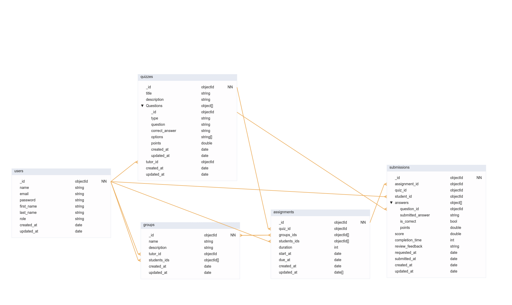

# Qwizyo Api


Qwizyo is a web application for creating and managing quizzes. It allows tutors to create quizzes for their students, track their performance, and analyze their results.

## Table of Contents

- [Overview](#overview)
- [Features](#features)
- [Installation](#installation)
- [Usage](#usage)
- [API Endpoints](#api-endpoints)
- [Contributing](#contributing)
- [License](#license)

## Overview

Qwizyo API is the backend component of the Qwizyo web application. It provides a RESTful API for managing users, groups, assignments, and quizzes.

## Features

- User management: Create, update, and delete users.
- Group management: Create, update, and delete groups of students.
- Assignment management: Create, update, and delete assignments for student groups.
- Quiz management: Create, update, and delete quizzes for assignments.

### Database Schema



## Installation

To run the Qwizyo API locally, follow these steps:

```bash
# Clone the repository
git clone https://github.com/your_username/qwizyo-api.git

# Navigate to the project directory
cd qwizyo-api

# Create a virtual environment
python3 -m venv .venv

# Activate the virtual environment
source .venv/bin/activate

# Install dependencies
pip install -r requirements.txt

# Create .env file with the following keys
# SECRET_KEY="TOP_SECRET"
# JWT_SECRET_KEY="SUPER_SECRET"
# MONGODB_URI="mongodb://localhost:27017/qwizyo"
# MONGODB_URI_DEV="mongodb://localhost:27017/qwizyo"
# ENV="dev"
touch .env
```

## Usage

To run the Qwizyo API, use the following command:

```bash
# Run the application
python run.py
```

The API will be accessible at `http://localhost:5000`.

## API Endpoints

The following API endpoints are available:

### Authentication Endpoints

- **POST /api/auth/register:** Register a new user (tutor or student).
- **POST /api/auth/login:** Authenticate user credentials and generate an access token.

### User Management Endpoints

- **GET /api/users/me:** Retrieve the current user's profile information.
- **PUT /api/users/me:** Update the current user's profile information.
- **GET /api/users/{user_id}:** Retrieve the profile information of a specific user (for admins or tutors).

### Group Management Endpoints

- **GET /api/groups:** Retrieve a list of groups associated with the current user (tutor).
- **POST /api/groups:** Create a new group.
- **GET /api/groups/{group_id}:** Retrieve details of a specific group.
- **PUT /api/groups/{group_id}:** Update group details.
- **DELETE /api/groups/{group_id}:** Delete a group.

### Quiz Management Endpoints

- **GET /api/quizzes:** Retrieve a list of quizzes created by the current user (tutor).
- **POST /api/quizzes:** Create a new quiz.
- **GET /api/quizzes/{quiz_id}:** Retrieve details of a specific quiz.
- **PUT /api/quizzes/{quiz_id}:** Update quiz details.
- **DELETE /api/quizzes/{quiz_id}:** Delete a quiz.

### Quiz Assignment Endpoints

- **POST /api/assignments:** Assign a quiz to a group or individual student.
- **GET /api/assignments:** Retrieve student assignments
- **GET /api/assignments/{assignment_id}:** Retrieve details of a specific assignment.
- **PUT /api/assignments/{assignment_id}:** Update assignment details.
- **DELETE /api/assignments/{assignment_id}:** Delete an assignment.
- **GET /api/groups/{group_id}/assignments:** Retrieve group assignments
- **GET /api/quizzes/{quiz_id}/assignments:** Retrieve quiz assignments

### Quiz Submission Endpoints

- **POST /api/submissions:** Submit answers for a quiz. (student)
- **GET /api/submissions:** Retrieve student submissions. (student)
- **GET /api/assignments/{assignment_id}/submissions:** Retrieve assignment submissions. (tutor)
- **GET /api/quizzes/{quiz_id}/submissions:** Retrieve assignment submissions. (tutor)
- **GET /api/submissions/{submission_id}:** Retrieve details of a specific submission.
- **PUT /api/submissions/{submission_id}:** Update submission details (e.g., resubmit answers). (tutor)
- **DELETE /api/submissions/{submission_id}:** Delete a submission. (tutor)

### Miscellaneous Endpoints

- **GET /api/ping:** Check if the server is up and running (for health checks).
- **GET /api/docs:** Access API documentation.

## Contributing

We welcome contributions from the community! If you encounter any issues, have feature requests, or would like to contribute code, please follow our [Contribution Guidelines](link_to_contributing_guide).

## License

This project is licensed under the [GPL-3.0 License](LICENSE).
